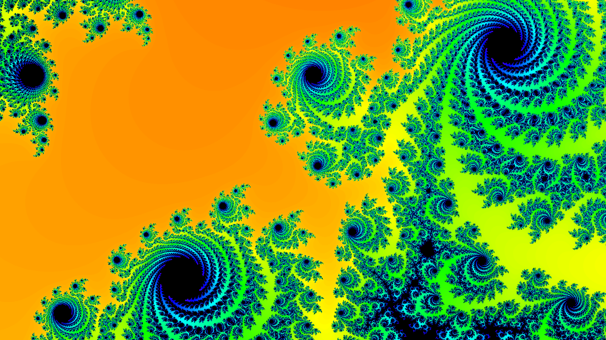

# mandelbrot-explorer
This is interactive [Mandelbrot set](https://en.wikipedia.org/wiki/Mandelbrot_set) explorer with support of panning and zooming. You can also save favourite views as high resolution images. 
Rendering is done by CPU so utilizing all of its available cores and making them run in parallel is good idea to make processing faster.
thats quite straightforward since generating Mandelbrot set is [Embarrassingly parallel](https://en.wikipedia.org/wiki/Embarrassingly_parallel) task. 

## Build
You need C++ compiler with support of openMP. GCC provides support since version 4.2.0. Also you need [SFML](https://www.sfml-dev.org/) library installed. you can build
from sources or on Debian/Ubuntu just run:
```
apt install libsfml-dev
```
then, clone this repository and `cd` to its directory
```
git clone https://github.com/giorgi43/mandelbrot-explorer.git
cd mandelbrot-explorer/
```
now, build with cmake:
```
cmake -S . -B bin
cd bin/
make
```
or manually:
```
g++ *.cpp -o explorer -lsfml-graphics -lsfml-system -lsfml-window -fopenmp -ffast-math -O3
```
## Usage
Use `W` `A` `S` `D` keys for moving around.
For zooming in and out, You have number of options:
* Using mouse scroll wheel
* With `+` and `-` keys
* or you can select rectangular region with mouse on the screen to zoom into

As you zoom further, number of iterations or bailout value must be increased for more details of the set to be shown.
 `J` `K` keys can be used to decrease/increase this value accordingly. keep in mind that on high bailout values CPU will take more time
 for computation.
Use `P` key to save current frame as png image
## Command line options
`Not implemented yet`
## Some images generated with this program
<p align="center">
    </img>
    </img>
    </img>
    </img>
    </img>
</p>

